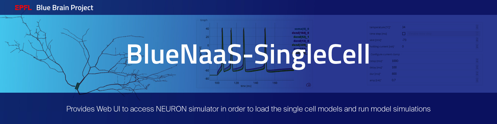
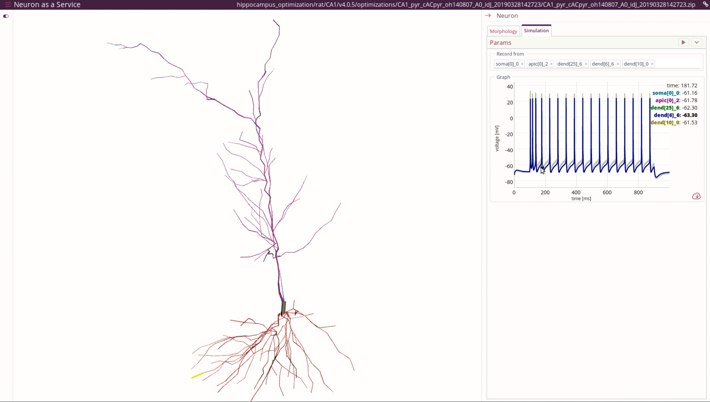

# BlueNaaS-SingleCell



Blue-Neuroscience-as-a-Service-SingleCell is an open source web application.
It enables users to quickly visualize single cell model morphologies in 3D
or as a dendrogram. Using simple Web user interface, single cell simulations
can be easily configured and launched, producing voltage traces from selected
compartments.

## Examples
You can use the application on the EBRAINS platform at https://ebrains-cls-interactive.github.io/online-use-cases.html by selecting "Single Cell InSilico Experiments". You can also follow this [direct link](https://blue-naas-bsp-epfl.apps.hbp.eu/#/url/hippocampus_optimization/rat/CA1/v4.0.5/optimizations_Python3/CA1_pyr_cACpyr_mpg141208_B_idA_20190328144006/CA1_pyr_cACpyr_mpg141208_B_idA_20190328144006.zip?use_cell=cell_seed3_0.hoc&bluenaas=true).



## Build frontend/backend dev images
```bash
make build
```

## Run dev frontend/backend
```bash
make run_dev_frontend &
make run_dev_backend &
```

## Citation
When you use the BlueNaaS-SingleCell software, we ask you to cite the following (TBD).

## Funding & Acknowledgment

The development of this software was supported by funding to the Blue Brain Project,
a research center of the École polytechnique fédérale de Lausanne (EPFL),
from the Swiss government's ETH Board of the Swiss Federal Institutes of Technology
and from the Human Brain Project's Specific Grant Agreement 3.

Copyright (c) 2022 Blue Brain Project/EPFL
